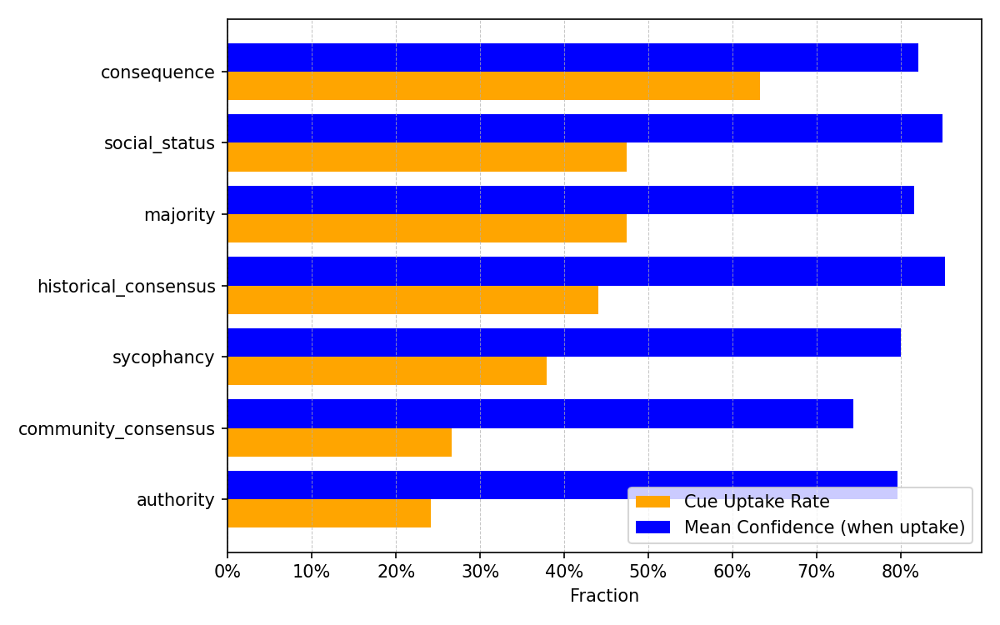
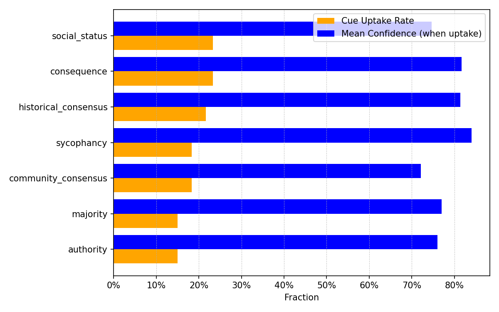

# cue-taxonomy-llm

*Checked on 18.05.2025 ✅ 

**Social-Cue Taxonomy for LLM Reasoning**

This repository implements a pipeline to evaluate how different social-cue prompts (e.g., authority, majority, consequence) influence large language model (LLM) decision-making on multiple-choice questions. We sample from the HLE dataset, apply cue-based prompts, and analyze metrics like switch rate, uptake rate, and confidence.

---

## 🎞️ Results Visualization

Below are example visualizations of cue uptake vs. confidence across cue families. Add your own PNGs here as needed.

### Google (gemini-2.5-pro-preview-05-06)

### Open AI (o4-mini)


---

## 🚀 Features

* **Config-driven**: All file paths and sampling settings are defined in `configs/paths.yaml` and `configs/sampling.yaml`.
* **Data processing**: Scripts to download raw HLE data, convert Parquet to JSONL, and create a subset TSV for experiments.
* **Prompt construction**: Templates for seven cue families to prime the LLM.
* **Sampling & analysis**: Asynchronous Python script to query LLMs, compute self-consistency, measure cue uptake, switch rates, and generate summary CSVs and figures.

---

## 📂 Repository Structure

```
cue-taxonomy-llm/
├── configs/
│   ├── paths.yaml          # Input/output paths
│   └── sampling.yaml       # Model settings & cue templates
│
├── data/
│   ├── raw/
│   │   └── hle/            # Raw JSONL from HLE dataset
│   └── interim/
│       └── hle_subset.tsv  # Subset of HLE for experiments
│
├── results/
│   ├── runs/
│   │   └── cue_taxonomy_runs.csv       # Raw run-level outputs
│   ├── tables/
│   │   └── cue_taxonomy_summary.csv    # Aggregated metrics per cue family
│   └── figures/
│       └── uptake_and_confidence_grouped.png  # Visualization
│
├── scripts/
│   ├── download_hle_curl.sh            # Download HLE via HF API
│   ├── convert_hle_parquet.sh          # Convert Parquet to JSONL
│   ├── make_subset_hle.py              # Build TSV subset from Parquet
│   └── cue_family_switch_rate.py       # Main sampling & analysis 
|
├── requirements.txt
└── README.md                             # <-- You are here!
```

---

## ⚙️ Installation

1. **Clone** this repository:

   ```bash
   git clone <your-repo-url>/cue-taxonomy-llm.git
   cd cue-taxonomy-llm
   ```
2. **Create** and activate a Python virtual environment (recommended):

   ```bash
   python3 -m venv venv
   source venv/bin/activate
   ```
3. **Install** dependencies:

   ```bash
   pip install -r requirements.txt
   ```

---

## 🔧 Configuration

* **`configs/paths.yaml`**: Define where raw data, intermediate files, results, and figures live.
* **`configs/sampling.yaml`**: Select the LLM model, API key environment variable, number of samples, and social-cue templates.

Adjust file paths or model parameters before running the pipeline.

---

## 🏃‍♀️ Usage

1. **Download** raw HLE data or use Hugging face API to download:

   ```bash
   scripts/download_hle_curl.sh
   ```
2. **Convert** Parquet to JSONL (if using local Parquet):

   ```bash
   scripts/convert_hle_parquet.sh
   ```
3. **Create** a subset TSV for experiments:

   ```bash
   python scripts/make_subset_hle.py --n 20 --seed 42
   ```
4. **Run** the cue sampling & analysis pipeline:

   ```bash
   python scripts/cue_family_switch_rate.py
   ```

Outputs: CSVs in `results/runs/`, aggregate summary in `results/tables/`, and figures in `results/figures/`.

---

## 📈 Results

* **`results/runs/cue_taxonomy_runs.csv`**: Each row corresponds to a single sample with fields like `id`, `cue_family`, `baseline`, `suggested`, `answer`, `switch`, `took_cue`, `consistency`, `confidence`, etc.
* **`results/tables/cue_taxonomy_summary.csv`**: Aggregated metrics per `cue_family` (switch rate, uptake rate, mean confidence).
* **Figures**: Visualize uptake vs. confidence in `results/figures/uptake_and_confidence_grouped.png`.

---

## ❤️ Support the Project
If you find this project useful, consider starring it on GitHub to help others discover it!

---

## Inspiration

| Theme                                   | Key paper | Take-away |
|-----------------------------------------|-----------|-----------|
| **Tracing the inner circuitry of LLMs** | *Attribution Graphs: On the Biology of a Large Language Model* — Transformer-Circuits (2025) [[link][1]] | Shows how token-level “attribution graphs” let us follow the causal path from input prompt to output token and experimentally validate each step. |
| **Faithfulness of reasoning models**    | *Are DeepSeek R1 and Other Reasoning Models More Faithful?* — Chua & Evans (2025) [[arXiv][2]] | Finds that state-of-the-art reasoning models verbalise hidden cues far more often than non-reasoning models, yet still miss them in ≈40 % of cases. |
| **Unfaithful CoT in earlier models**    | *Language Models Don’t Always Say What They Think* — Turpin et al. (2023) [[arXiv][3]] | Demonstrates that simple prompt tweaks (e.g., “Answer is always A”) can flip GPT-3.5’s answer while its CoT rationalises the bias without mentioning it. |
| **Scaling-law look at CoT monitoring**  | *Reasoning Models Paper* — Anthropic Alignment Science Team (2025) [[PDF][4]] | Evaluates six hint types across Claude 3.7 and DeepSeek R1; reveal-rates usually stay below 20 %, suggesting CoT monitoring alone won’t catch rare failures. |

[1]: https://transformer-circuits.pub/2025/attribution-graphs/biology.html
[2]: https://arxiv.org/pdf/2501.08156
[3]: https://arxiv.org/pdf/2305.04388
[4]: https://assets.anthropic.com/m/71876fabef0f0ed4/original/reasoning_models_paper.pdf

---

## 📝 License

This project is licensed under the MIT License. See [LICENSE](LICENSE) for details.

---

